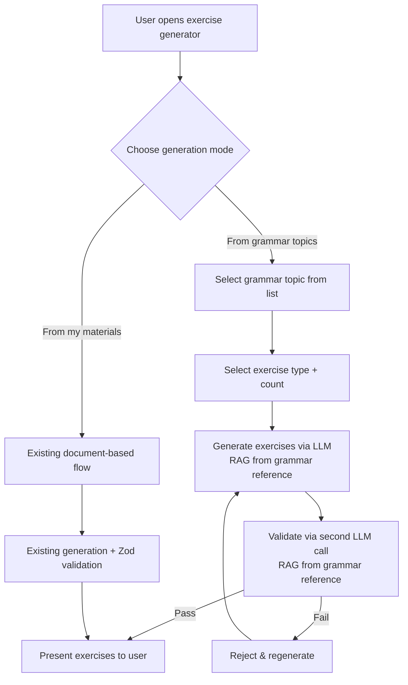

# Grammar Topic-Based Exercise Generation

## Problem Frame

Currently, exercise generation is entirely document-driven — users must upload learning materials (PDFs, URLs, or text) before they can generate exercises. This creates a barrier for users who want to practice specific Italian grammar topics without preparing materials first. Users studying Italian grammar need a way to select a grammar topic and immediately generate exercises, with confidence that the exercises are grammatically correct.

An Italian grammar reference textbook (PDF) is available as an authoritative corpus. This reference can ground both exercise generation and validation through RAG, eliminating the need for a hand-built grammar rules database.

## Requirements

**Generation Modes**

- R1. The exercise generator UI presents two distinct modes: "From my materials" (existing document-based flow) and "From grammar topics" (new topic-based flow). This is a separate capability from the existing topic-guided generation.
- R2. "From grammar topics" mode does not require any uploaded documents. Exercises are generated via LLM using RAG context from a system-level Italian grammar reference corpus.
- R3. The existing "From my materials" flow remains unchanged, including its free-text "Topic Focus" field and document selection.

**Grammar Topic Selection**

- R4. Users select a grammar topic from a curated static list. The initial v1 set includes 12 topics:
  1. Presente indicativo
  2. Passato prossimo
  3. Imperfetto
  4. Futuro semplice
  5. Condizionale presente
  6. Congiuntivo presente
  7. Articoli determinativi e indeterminativi
  8. Pronomi diretti
  9. Pronomi indiretti
  10. Pronomi riflessivi
  11. Preposizioni semplici
  12. Comparativi e superlativi
- R5. The topic list is maintained as structured application data and can be expanded via deployment without code changes.
- R6. All three exercise types (multiple choice, fill the gap, single answer) are available for grammar topic generation.

**Grammar Reference Corpus**

- R7. An Italian grammar reference PDF is ingested as a system-level resource, stored in a separate reference table (not the user documents table), with its chunks embedded and indexed for RAG retrieval.
- R8. The grammar reference is used as RAG context for both exercise generation (grounding the LLM in authoritative rules) and validation (providing the reference material for the validation check).

**Grammar Validation**

- R9. Each generated exercise is validated by a second LLM call that checks grammatical correctness against the grammar reference RAG context. The validation prompt asks whether the exercise uses correct forms for the stated grammar topic.
- R10. Exercises that fail grammar validation are rejected and regenerated (up to the existing per-exercise retry limit).
- R11. Grammar validation applies only to topic-based exercises. Document-based exercises continue using the existing Zod schema validation only.

**Data Model**

- R12. Topic-based exercises are stored in the exercises table. A new reference table stores the grammar reference corpus separately from user documents. The sourceReferences contract for topic-based exercises must be addressed — either by making sourceDocumentIds/sourceChunkIds nullable or by introducing a reference-specific source link.
- R13. The generation_jobs table and request validation must support jobs without user-uploaded documentIds for the topic-based generation path.

## Success Criteria

- Users can generate grammatically correct exercises by selecting a topic, without uploading any materials.
- Grammar validation (LLM + grammar reference RAG) catches mechanical errors (wrong conjugation, gender/article mismatch, incorrect preposition) before exercises reach the user at a meaningful rate — target to be refined after measuring baseline LLM error rates during planning.
- The two generation modes are clearly distinguished in the UI — users understand what each mode does.

## Scope Boundaries

- Grammar validation covers mechanical/structural rules grounded in the grammar reference, not contextual or stylistic correctness.
- No CEFR-level organization of topics in v1 — topics are presented as a flat list.
- No hybrid mode combining grammar topics + user documents in v1.
- The curated topic list is static at deploy time; no admin UI for editing topics.
- Grammar validation applies only to topic-based exercises, not document-based exercises. Document-based exercises are grounded in user-provided source text, so grammar errors reflect the source material rather than LLM generation quality.

## Key Decisions

- **Independent generation mode**: Topic-based generation works without user documents, using the grammar reference corpus as RAG context. This removes the upload barrier for grammar practice. This is a separate capability from the existing topic-guided multi-source generation.
- **RAG-grounded LLM validation over grammar DB**: Instead of building a hand-crafted grammar rules database with conjugation tables and agreement rules (which would require sentence parsing to validate free-text exercises), the grammar reference PDF is used as RAG context for a second LLM validation call. This avoids data engineering, sidesteps the NLP parsing problem, and grounds validation in an authoritative source.
- **Separate reference table**: The grammar reference corpus is stored in its own table, not mixed with user documents. This provides clear isolation between system-level reference material and user-uploaded content.
- **Curated static topic list**: Simpler than deriving topics dynamically. Can be expanded incrementally.
- **Two distinct UI modes**: Clearer than overloading the existing form. Each mode shows only the controls relevant to that generation path.

## Dependencies / Assumptions

- The Italian grammar reference PDF is available and covers the grammar topics in the initial curated list.
- The existing document ingestion pipeline (PDF extraction, chunking, embedding) can be reused to ingest the grammar reference into the separate reference table.
- Mistral LLM can generate quality Italian grammar exercises when grounded in grammar reference RAG context.
- The existing async generation job infrastructure (generation_jobs table, polling) can be extended for topic-based generation, but requires schema changes to support jobs without user documentIds.

## Outstanding Questions

### Deferred to Planning

- [Affects R12][Technical] How should the exercises table handle sourceReferences for topic-based exercises — make sourceDocumentIds/sourceChunkIds nullable, or introduce a reference-specific source link column?
- [Affects R13][Technical] What schema changes are needed to generationJobsSchema and GenerateExercisesRequestSchema to support jobs without user documentIds?
- [Affects R7][Technical] What schema design should the reference table use, and how should grammar reference chunks be indexed for topic-specific retrieval?
- [Affects R9][Needs research] What prompt structure produces the best validation results — should the validation LLM call receive the exercise + grammar reference chunks + topic, and what criteria should it check?
- [Affects R2][Needs research] What prompt structure produces the best grammar exercises from Mistral with grammar reference RAG context?
- [Affects R5][Technical] What format should the curated topic list use (JSON seed file, TypeScript constant, DB seed migration)?
- [Affects R9][Needs research] What is the baseline error rate of LLM-generated grammar exercises with reference RAG grounding? This informs whether validation adds meaningful value and what the success threshold should be.

## Next Steps

-> `/ce:plan` for structured implementation planning.
