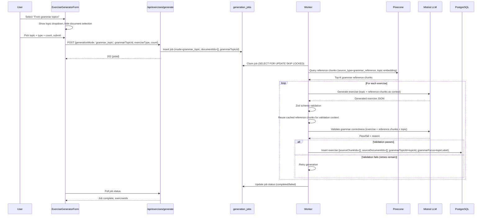
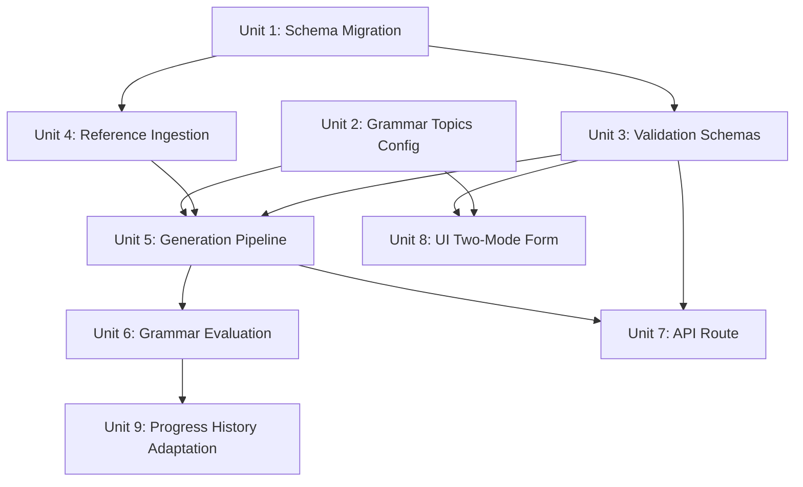

# feat: Add Grammar Topic-Based Exercise Generation

## Overview

Add a second exercise generation mode that lets users select an Italian grammar topic from a curated list and generate exercises without uploading documents. A system-level grammar reference PDF provides RAG context for both generation and a second-pass LLM validation that checks grammatical correctness before exercises reach the user.

## Problem Frame

Exercise generation is currently document-dependent — users must upload materials before generating exercises. This creates friction for users who want to practice specific grammar topics immediately. An Italian grammar reference textbook (PDF) is available as an authoritative corpus that can ground both generation and validation via RAG. (see origin: `docs/brainstorms/2026-03-31-grammar-topic-exercise-generation-requirements.md`)

## Requirements Trace

- R1. Two distinct UI modes: "From my materials" and "From grammar topics"
- R2. Grammar topic mode generates via LLM with RAG from grammar reference corpus (no user documents)
- R3. Existing document-based flow unchanged
- R4. Curated static list of 12 grammar topics
- R5. Topic list expandable via deployment without code changes
- R6. All three exercise types available for grammar topic generation
- R7. Grammar reference PDF ingested into separate reference table with embeddings
- R8. Grammar reference used as RAG context for both generation and validation
- R9. Second LLM call validates grammatical correctness against reference
- R10. Failed validation triggers regeneration (up to existing retry limit)
- R11. Grammar validation applies only to topic-based exercises
- R12. Exercises table and sourceReferences contract adapted for document-free exercises
- R13. generation_jobs and request validation support jobs without user documentIds

## Scope Boundaries

- No CEFR-level topic organization in v1 — flat list
- No hybrid mode combining grammar topics + user documents in v1
- No admin UI for editing topics — static at deploy time
- Grammar validation only for topic-based exercises, not document-based (see origin for rationale)
- Validation covers mechanical grammar grounded in the reference, not contextual/stylistic correctness

## Context & Research

### Relevant Code and Patterns

- **Schema**: `src/models/Schema.ts` — exercises table (line ~125), generation_jobs table (line ~177), documents/chunks tables
- **Validation**: `src/validations/ExerciseValidation.ts` — `GenerateExercisesRequestSchema` (line 32, requires `documentIds.min(1)`), `GeneratedExerciseSchema` (line 48, requires `sourceReferences.min(1)`)
- **Generation pipeline**: `src/libs/ExerciseGeneration.ts` — enqueue (line 911), claim (line 516), process (line 562), candidate retrieval, prompt building, Mistral call, exercise insertion
- **Prompts**: `src/libs/ExercisePrompts.ts` — system prompt (line 73), user prompt (line 89), both assume excerpt-based context
- **Ingestion**: `src/libs/ContentIngestion.ts` — PDF extraction, chunking, embedding, Pinecone upsert pattern
- **UI**: `src/components/exercises/ExerciseGeneratorForm.tsx` — form with document selection, disables submit when no documents
- **Dashboard**: `src/components/exercises/ExercisesDashboard.tsx` — orchestrates form, polling, exercise display
- **API route**: `src/app/[locale]/api/exercises/generate/route.ts` — thin validation + enqueue + 202
- **Mistral client**: `src/libs/Mistral.ts` — `createStructuredChatCompletion`, `createEmbeddings`
- **Existing topic-guided plan**: `docs/plans/topic-guided-multi-source-exercise-generation-plan.md` — changed sourceReferences semantics to "supporting materials" but still requires documents

### Institutional Learnings

- **Source provenance** (`docs/solutions/.../exercise-generation-hardening-pr23`): Use globally unique `(documentId, chunkPosition)` tuples, not position-only. For reference chunks, use `(referenceId, chunkPosition)`.
- **Prompt injection** (`docs/solutions/.../answer-evaluation-hardening-pr26`): Never interpolate untrusted text into prompt delimiters. Use JSON-serialized payloads. Grammar reference content is trusted (system-level), but generated exercise content in the validation prompt should still be treated carefully.
- **Polling** (`docs/solutions/.../exercise-generation-hardening-pr23`): Use gate locks for async polling. The existing dashboard already implements this.
- **Deletion ordering**: Pinecone cleanup before relational cascades. Reference chunks will need similar cleanup if references are ever deleted.

## Key Technical Decisions

- **Empty arrays for sourceChunkIds/sourceDocumentIds**: PostgreSQL NOT NULL array columns accept empty arrays `'{}'`. Rather than making these nullable (breaking change), topic-based exercises use empty arrays. A new `generationMode` column distinguishes exercise provenance. This avoids a migration that changes column nullability on the exercises table.
- **Discriminated union for request schema**: A single `GenerateExercisesRequestSchema` with a `generationMode` discriminator. Document mode requires `documentIds.min(1)`, grammar topic mode requires `grammarTopicId` and forbids `documentIds`. This keeps one API endpoint with clear type narrowing while preserving a stable topic identifier from UI through worker processing.
- **Separate reference tables**: `grammarReferences` and `grammarReferenceChunks` tables mirror the documents/chunks pattern but are isolated from user data. Reference chunks are stored in Pinecone with `source_type: 'grammar_reference'` metadata for filtered retrieval (using `source_type` rather than overloading the existing `content_type` field which maps to PDF/URL/text document types).
- **Topic list as TypeScript constant**: A `src/libs/GrammarTopicConfig.ts` file exports the topic list with IDs and display names, following the existing `*Config.ts` convention (`PdfConfig.ts`, `UrlConfig.ts`, `EmbeddingConfig.ts`). Type-safe, zero runtime overhead, expandable by editing one file and deploying.
- **Stable topic IDs with backward-compatible display fields**: Store a stable `grammarTopicId` for topic-mode jobs and exercises, but continue populating the existing `grammarFocus` column with the topic display label for grammar-topic exercises. This avoids a broad presentation/evaluation migration because current UI cards, presenters, and answer evaluation already read `grammarFocus`.
- **Separate retry budgets for generation and validation**: Structural generation failures (Zod, type mismatch, dedup) use the existing `MAX_GENERATION_ATTEMPTS = 3` budget. Grammar validation failures use a separate `MAX_VALIDATION_RETRIES = 2` budget per exercise. When validation fails, the exercise is regenerated with the validation reason injected as a hint. This prevents grammar validation from exhausting the structural retry budget. LLM API errors during validation are not counted against either budget — they use a separate error-handling path.
- **Grammar-topic-specific LLM output schema**: The `createStructuredChatCompletion` call constrains LLM output to a Zod schema. A `GrammarTopicGeneratedExerciseSchema` variant omits `sourceReferences` to prevent Mistral from hallucinating reference IDs. This is critical — using the document-mode schema would cause all grammar-topic generation to fail.
- **Structured output for grammar validation**: The second-pass grammar validation call should also use structured output with a minimal schema such as `{ valid: boolean, reason?: string }`, rather than raw JSON mode. This keeps validation failures about grammar judgments instead of malformed JSON transport/parsing noise and matches the existing evaluation pattern already used elsewhere in the codebase.
- **Pinecone namespace reuse**: Grammar reference vectors go into the same `content` namespace but with distinct metadata (`source_type: 'grammar_reference'`, `reference_id`). Topic-based retrieval filters on `source_type` instead of `user_id`/`document_id`.

## Open Questions

### Resolved During Planning

- **sourceReferences for topic-based exercises**: Empty arrays — PostgreSQL NOT NULL arrays accept `'{}'`. No column nullability migration needed.
- **generation_jobs.documentIds for topic-based jobs**: Empty array. The NOT NULL constraint is on the column, not on array length. Only the Zod schema enforces min(1), which the discriminated union handles.
- **Topic identity and display compatibility**: Use `grammarTopicId` as the stable stored identifier, and continue filling `grammarFocus` with the topic display label so existing exercise presentation and answer-evaluation paths keep working.
- **Reference table schema**: Mirrors documents/chunks pattern with `grammarReferences` and `grammarReferenceChunks` tables.
- **Topic list format**: TypeScript constant in `src/libs/GrammarTopicConfig.ts`, following existing `*Config.ts` convention.
- **Validation integration point**: Inside the grammar topic generation loop, after Zod validation, before insertion. Uses a separate validation retry budget (`MAX_VALIDATION_RETRIES = 2`) independent of the structural generation retry budget.
- **LLM output schema**: A `GrammarTopicGeneratedExerciseSchema` variant without `sourceReferences` is passed to `createStructuredChatCompletion` for grammar-topic generation. This prevents Mistral from hallucinating document references.
- **Pinecone metadata key**: `source_type` (not `content_type`) distinguishes grammar reference vectors from user document vectors, avoiding semantic overload of the existing `content_type` field.

### Deferred to Implementation

- **Exact prompt wording**: The generation and validation prompts will need iterative refinement. The plan specifies the prompt structure and inputs, not final copy.
- **Baseline error rate measurement**: Will be observable from validation pass/fail rates in production. Not a blocker for implementation.
- **Pinecone query tuning**: The `topK` value and similarity threshold for grammar reference retrieval may need adjustment based on the reference PDF's chunk quality.

## High-Level Technical Design

> *This illustrates the intended approach and is directional guidance for review, not implementation specification. The implementing agent should treat it as context, not code to reproduce.*

## Implementation Units

- [ ] **Unit 1: Database schema migration — reference tables and exercise columns**

**Goal:** Create the reference corpus tables and add generation mode tracking to exercises and generation_jobs.

**Requirements:** R7, R12, R13

**Dependencies:** None

**Files:**
- Create: `migrations/XXXX_add_grammar_reference_tables.sql` (via `drizzle-kit generate`)
- Modify: `src/models/Schema.ts`

**Approach:**
- Add `generation_mode` enum type: `'document' | 'grammar_topic'`
- Add `grammarReferences` table: `id` (uuid PK), `title` (text), `sourceFilename` (text), `status` (enum: processing/ready/failed), `totalChunks` (integer), `createdAt`, `updatedAt`
- Add `grammarReferenceChunks` table: `id` (uuid PK), `referenceId` (uuid FK → grammarReferences, cascade), `position` (integer), `content` (text), `embeddingId` (text), `createdAt`. Add index on `referenceId`.
- Add to `exercises` table: `generationMode` (generation_mode enum, NOT NULL, default 'document'), `grammarTopicId` (text, nullable)
- Continue using the existing `grammarFocus` column for the learner-facing topic label in both document-mode topic focus and grammar-topic mode display compatibility
- Add to `generation_jobs` table: `generationMode` (generation_mode enum, NOT NULL, default 'document'), `grammarTopicId` (text, nullable)
- Default values ensure backward compatibility — existing rows get `'document'` mode
- Run `drizzle-kit generate` to produce the migration SQL

**Patterns to follow:**
- Existing `documents` and `chunks` table definitions in `Schema.ts` (same FK/cascade/index patterns)
- Existing enum definitions (`exerciseTypeEnum`, `difficultyEnum`) for `generationModeEnum`
- Existing migration files in `migrations/` directory

**Test scenarios:**
- Happy path: migration applies cleanly on fresh DB and on DB with existing data
- Happy path: existing exercises get default `generationMode = 'document'` after migration
- Edge case: empty arrays `'{}'` are accepted for `sourceChunkIds`/`sourceDocumentIds` on new exercise inserts (verify PostgreSQL accepts this with NOT NULL constraint)

**Verification:**
- `drizzle-kit generate` produces a valid migration file
- Migration applies without errors on local PGlite dev database
- Existing exercise and generation_jobs queries continue to work unchanged

---

- [ ] **Unit 2: Grammar topics config**

**Goal:** Create the curated list of 12 Italian grammar topics as a typed config file.

**Requirements:** R4, R5

**Dependencies:** None

**Files:**
- Create: `src/libs/GrammarTopicConfig.ts`
- Create: `src/libs/GrammarTopicConfig.test.ts`

**Approach:**
- Export a `GRAMMAR_TOPICS` array of objects with `id` (kebab-case slug like `presente-indicativo`), `name` (Italian display name), and `description` (brief English explanation for UI context)
- Export a `GrammarTopic` type derived from the array
- Export a lookup helper `getGrammarTopicById(id)` that returns the topic or undefined
- The 12 topics from R4 are the initial set

**Patterns to follow:**
- Existing `*Config.ts` files in `src/libs/`: `PdfConfig.ts`, `UrlConfig.ts`, `EmbeddingConfig.ts` — export typed constants with module-level data

**Test scenarios:**
- Happy path: `GRAMMAR_TOPICS` has exactly 12 entries with unique IDs
- Happy path: `getGrammarTopicById('presente-indicativo')` returns the correct topic
- Edge case: `getGrammarTopicById('nonexistent')` returns undefined
- Edge case: all IDs are valid kebab-case slugs

**Verification:**
- Importing `GRAMMAR_TOPICS` provides full TypeScript type narrowing
- Adding a 13th topic requires only editing this one file

---

- [ ] **Unit 3: Request and exercise validation schema changes**

**Goal:** Update Zod schemas to support grammar-topic generation requests and exercises without sourceReferences.

**Requirements:** R12, R13, R6

**Dependencies:** Unit 1 (generationMode enum must exist in schema)

**Files:**
- Modify: `src/validations/ExerciseValidation.ts`
- Modify: `src/validations/__tests__/ExerciseValidation.test.ts` (or create if absent)

**Approach:**
- Refactor `GenerateExercisesRequestSchema` into a discriminated union on `generationMode`:
  - `'document'` mode: requires `documentIds.min(1).max(10)`, optional `topicFocus` — preserves current behavior exactly
  - `'grammar_topic'` mode: requires `grammarTopicId` (string, validated against topic IDs), forbids `documentIds`, no `topicFocus`
  - Both modes share: `exerciseType`, `count`, `difficulty`
- Create `GrammarTopicGeneratedExerciseSchema`: a variant of `GeneratedExerciseSchema` that omits `sourceReferences` entirely. This schema is passed to `createStructuredChatCompletion` for grammar-topic generation — critical because the Mistral structured output mode constrains LLM output to match the schema, and if `sourceReferences` is required, Mistral will hallucinate document IDs. The existing `GeneratedExerciseSchema` (with `sourceReferences.min(1)`) continues to be used for document-mode generation.
- Create a shared `GeneratedExercisesResponseSchema` variant that wraps the grammar-topic exercise schema in the same response envelope
- Export the mode-specific types for downstream consumers

**Patterns to follow:**
- Existing Zod discriminated unions in the codebase (check for examples)
- Existing `GenerateExercisesRequestSchema` refinement for unique documentIds

**Test scenarios:**
- Happy path: document mode request with documentIds validates successfully
- Happy path: grammar_topic mode request with `grammarTopicId` validates successfully
- Error path: grammar_topic mode with documentIds present is rejected
- Error path: document mode without documentIds is rejected
- Error path: grammar_topic mode with invalid topic ID is rejected
- Edge case: grammar_topic mode with all three exercise types validates
- Happy path: generated exercise without sourceReferences validates in grammar_topic context

**Verification:**
- All existing tests pass (document mode is backward compatible)
- New grammar_topic mode validates correctly with type narrowing

---

- [ ] **Unit 4: Grammar reference ingestion pipeline**

**Goal:** Adapt the content ingestion pipeline to ingest the grammar reference PDF into the reference tables and Pinecone.

**Requirements:** R7, R8

**Dependencies:** Unit 1 (reference tables must exist)

**Files:**
- Create: `src/libs/ReferenceIngestion.ts`
- Create: `src/libs/ReferenceIngestion.test.ts`
- Create: `src/app/api/internal/reference/ingest/route.ts` (no `[locale]` — internal routes are not locale-aware)
- Create: `src/app/api/internal/reference/ingest/route.test.ts`
- Modify: `src/libs/Pinecone.ts` (refactor `ChunkMetadata` into a discriminated union for user document vs. grammar reference vectors)

**Approach:**
- Create `ReferenceIngestion.ts` following the `ContentIngestion.ts` internal structure (JSDoc header, types with `success`/`errorCode` pattern, constants, private helpers, exported async functions):
  - Accept a PDF file path or buffer
  - Extract text via `PdfExtractor`
  - Chunk via `TextChunker` (reuse existing Italian-aware chunker)
  - Generate embeddings via `createEmbeddingsBatched`
  - Store chunks in `grammarReferenceChunks` table (transactional)
  - Upsert vectors to Pinecone with metadata: `{ source_type: 'grammar_reference', reference_id, chunk_position, text }` — using `source_type` (not `content_type`) to avoid overloading the existing document content type field
  - Update reference status to `ready`
- Refactor `ChunkMetadata` type in `Pinecone.ts` into a discriminated union on `source_type`:
  - `UserDocumentChunkMetadata`: `{ source_type: 'user_document', user_id: string, document_id: string, content_type: 'pdf' | 'url' | 'text', chunk_position: number, text: string, created_at: string }`
  - `GrammarReferenceChunkMetadata`: `{ source_type: 'grammar_reference', reference_id: string, chunk_position: number, text: string }`
  - Export `ChunkMetadata = UserDocumentChunkMetadata | GrammarReferenceChunkMetadata`
  - Existing Pinecone consumers that read `user_id`/`document_id` from metadata must narrow on `source_type` first. Since existing vectors lack `source_type`, treat missing `source_type` as `'user_document'` during the transition (or backfill existing vectors with `source_type: 'user_document'` metadata)
- Create an internal API route at `src/app/api/internal/reference/ingest/route.ts` (protected by bearer token auth, same pattern as `generation-jobs/dispatch`)
- Pinecone vector IDs follow pattern: `ref_{referenceId}_chunk_{position}`
- No user-level quota or rate limiting (system-level operation)

**Patterns to follow:**
- `ContentIngestion.ts` — JSDoc header, types-then-constants-then-private-helpers-then-exports structure, result types with `success`/`errorCode`
- `PdfExtractor.ts` — PDF text extraction
- `TextChunker.ts` — Italian-aware chunking
- Pinecone upsert pattern with metadata in `ContentIngestion.ts`
- Internal route auth pattern from `src/app/api/internal/generation-jobs/dispatch/route.ts` (bearer token, no Clerk)

**Test scenarios:**
- Happy path: PDF text is extracted, chunked, embedded, and stored in reference tables
- Happy path: Pinecone vectors upserted with correct `source_type: 'grammar_reference'` metadata
- Happy path: reference status transitions from `processing` to `ready`
- Error path: invalid PDF (no text extractable) → reference status set to `failed`
- Error path: Pinecone upsert fails → reference status set to `failed`, chunks rolled back
- Edge case: re-ingesting a reference (same filename) replaces the old one

**Verification:**
- After ingestion, `grammarReferenceChunks` table contains chunks with valid content
- Pinecone query with `source_type: 'grammar_reference'` filter returns the ingested vectors
- Reference record shows `status: 'ready'`

---

- [ ] **Unit 5: Generation pipeline — grammar topic code path**

**Goal:** Add a branching code path in the generation worker for grammar-topic-based exercise generation using grammar reference RAG.

**Requirements:** R2, R8, R10

**Dependencies:** Unit 1, Unit 3, Unit 4

**Files:**
- Modify: `src/libs/ExerciseGeneration.ts` (enqueue, claim, process functions + `ClaimedGenerationJob` type)
- Create: `src/libs/GrammarTopicPrompts.ts`
- Create: `src/libs/GrammarTopicPrompts.test.ts`

**Approach:**
- In `enqueueExerciseGeneration`: skip `validateDocumentsReady` when `generationMode === 'grammar_topic'`. Store `generationMode` and `grammarTopicId` in the job row. Pass empty array for `documentIds`.
- Update `ClaimedGenerationJob` type to include `generationMode` and `grammarTopicId` fields.
- Update `claimNextGenerationJob` to select the new `generationMode` and `grammarTopicId` columns from the job row.
- In `runClaimedGenerationJob`: the existing code re-parses the job row through `GenerateExercisesRequestSchema.parse(...)` (line ~568). This must now include `generationMode` (and `grammarTopicId` when applicable) so the discriminated union selects the correct branch. Without `generationMode`, the parse will fail for grammar-topic jobs because the default document branch requires `documentIds.min(1)`.
- Branch early based on `generationMode`:
  - **Document mode**: existing flow unchanged
  - **Grammar topic mode**: new flow:
    1. Query Pinecone for grammar reference chunks using a **new query function** (e.g., `getGrammarReferenceChunks`) that filters by `source_type: 'grammar_reference'` instead of `user_id`/`document_id`. The existing `getCandidateChunksForRequest` cannot be reused because it filters on `user_id` and `document_id` and returns `GenerationCandidate` objects with `documentId`. The new function uses the grammar topic label as the embedding query (e.g., "Italian grammar presente indicativo exercises"), `topK: 15` for broader reference coverage, and returns a simpler type (e.g., `GrammarReferenceCandidate`) with `referenceId`, `chunkPosition`, `text`.
    2. For each exercise in the batch, select a rotating subset of reference chunks (reuse the existing `EXCERPT_SUBSET_SIZE` rotation pattern)
    3. Build prompts via new `GrammarTopicPrompts.ts` (separate from `ExercisePrompts.ts` to keep concerns clean)
    4. Call Mistral structured generation with `GrammarTopicGeneratedExerciseSchema` (from Unit 3) — critical: this schema omits `sourceReferences` so the LLM does not hallucinate document IDs
    5. Validate response via Zod (using the grammar_topic schema variant)
    6. Grammar validation step (Unit 6) runs here
    7. Skip `resolveChunkIds` — grammar-topic exercises use `sourceChunkIds: []` and `sourceDocumentIds: []`. The grammar reference chunks used for prompt context are not persisted as exercise source references.
    8. Insert exercise with `generationMode: 'grammar_topic'`, `grammarTopicId`, `grammarFocus: grammarTopic.name`, `sourceChunkIds: []`, `sourceDocumentIds: []`
- `GrammarTopicPrompts.ts`: Follow the `build*Prompt` export naming convention. New system prompt establishing the model as an Italian grammar exercise expert. User prompt provides: the grammar topic label, exercise type rules, reference material excerpts (formatted like existing excerpts but labeled as "grammar reference"), previous questions for dedup, and optional retry hints from prior validation failures. No `sourceReferences` instruction — the model produces just `question` and `exerciseData`. Co-locate static lookup data (rules, examples) as module-level constants within the file.

**Patterns to follow:**
- Existing branching in `runClaimedGenerationJob` for candidate retrieval and subset selection
- `ExercisePrompts.ts` format for system/user prompt separation
- Existing `createStructuredChatCompletion` / `createJsonChatCompletion` fallback pattern
- `resolveChunkIds` pattern for mapping Pinecone results to DB chunk records

**Test scenarios:**
- Happy path: grammar topic job enqueues successfully with empty documentIds
- Happy path: worker claims and processes a grammar topic job, generates exercises
- Happy path: Pinecone query returns grammar reference chunks filtered by source_type
- Happy path: exercises inserted with empty sourceChunkIds/sourceDocumentIds, correct `grammarTopicId`, and `grammarFocus` populated with the topic label
- Error path: no grammar reference chunks found in Pinecone → job fails with descriptive error
- Error path: Mistral returns invalid exercise structure → retry with same reference chunks
- Edge case: all 3 exercise types generate correctly in grammar topic mode
- Edge case: dedup works across exercises in the same grammar topic batch
- Integration: grammar topic job goes through full claim → generate → insert → complete lifecycle

**Verification:**
- A grammar topic generation job produces exercises stored in the DB with `generationMode: 'grammar_topic'`
- Existing document-based generation is unaffected (regression)
- Job status transitions correctly: pending → processing → completed/failed

---

- [ ] **Unit 6: Grammar evaluation LLM call**

**Goal:** Add a second LLM call that validates each generated exercise against the grammar reference before insertion.

**Requirements:** R9, R10, R11

**Dependencies:** Unit 5

**Files:**
- Create: `src/libs/GrammarEvaluation.ts` (named `*Evaluation.ts` to match `AnswerEvaluation.ts` pattern and avoid confusion with `src/validations/` Zod schemas)
- Create: `src/libs/GrammarEvaluation.test.ts`
- Modify: `src/libs/ExerciseGeneration.ts` (integrate validation into the grammar topic generation loop)

**Approach:**
- `GrammarEvaluation.ts` exports `validateExerciseGrammar({ exercise, grammarTopicLabel, referenceChunks })`:
  - Builds a validation prompt: provides the exercise question + answer(s), the grammar topic, and the relevant reference chunks
  - Instructs the LLM to check: correct verb conjugation, article/noun agreement, preposition usage, and any other mechanical grammar rules for the stated topic
  - Uses `createStructuredChatCompletion` with a minimal Zod schema such as `{ valid: boolean, reason?: string }`
  - Serializes exercise content as JSON data in the prompt (per institutional learning on prompt injection prevention)
  - Returns `{ valid: boolean, reason?: string }`
- Integration point: in the grammar topic generation loop in `ExerciseGeneration.ts`, after Zod validation passes and before exercise insertion:
  - Call `validateExerciseGrammar`
  - If `valid: true` → proceed to insert
  - If `valid: false` → count against `MAX_VALIDATION_RETRIES = 2` budget (separate from the structural `MAX_GENERATION_ATTEMPTS = 3`). Regenerate with the validation reason injected as a hint in the prompt.
  - If Mistral API error → do not count against either retry budget. Retry the API call with exponential backoff (reuse existing Mistral retry config).
  - Log validation failures with the reason for observability
- Validation only runs for `generationMode === 'grammar_topic'` (R11)
- Reuse the same reference chunks already retrieved for generation (no second Pinecone query per exercise — the chunks are cached for the batch)

**Patterns to follow:**
- `AnswerEvaluation.ts` in `src/libs/` — similar pattern of LLM-based evaluation with structured output
- `Mistral.ts` `createStructuredChatCompletion` for the validation call
- Prompt injection prevention: serialize exercise content as JSON data in the validation prompt (per institutional learning)

**Test scenarios:**
- Happy path: grammatically correct exercise passes validation → `{ valid: true }`
- Happy path: exercise with wrong conjugation fails validation → `{ valid: false, reason: "..." }`
- Happy path: validation failure triggers regeneration with hint, second attempt passes
- Error path: Mistral validation call fails (API error) → retried without consuming validation budget
- Error path: both validation retries fail → exercise skipped, job `failedCount` incremented
- Edge case: validation prompt handles all three exercise types (MC options, fill-gap answer, single answer)
- Integration: validation integrates into the generation loop without disrupting document-based flow

**Verification:**
- Grammar validation runs only for grammar_topic exercises, not document-based
- Validation failures consume the validation retry budget (separate from structural retries)
- Validation pass/fail rates are observable in logs

---

- [ ] **Unit 7: API route changes**

**Goal:** Update the exercise generation API route to accept the new grammar topic request shape.

**Requirements:** R1, R13

**Dependencies:** Unit 3, Unit 5

**Files:**
- Modify: `src/app/[locale]/api/exercises/generate/route.ts`

**Approach:**
- The route already parses JSON and validates with the request schema. Since Unit 3 updates `GenerateExercisesRequestSchema` to a discriminated union, the route mostly works as-is.
- Key change: the validated request now carries `generationMode` and conditionally has `documentIds` or `grammarTopicId`. Pass the full parsed request to `enqueueExerciseGeneration` — the enqueue function (updated in Unit 5) handles the branching.
- Rate limiting and auth remain unchanged.
- Error responses: add a check that grammar reference is available (at least one reference with `status: 'ready'`) before enqueuing a grammar_topic job. Return 422 with a clear message if no reference is ingested.

**Patterns to follow:**
- Existing route structure in `generate/route.ts`
- Error response pattern: `{ error: string, code: string }`

**Test scenarios:**
- Happy path: grammar_topic request enqueues successfully, returns 202 with jobId
- Happy path: document request continues to work unchanged
- Error path: grammar_topic request when no grammar reference is ingested → 422
- Error path: malformed grammar_topic request (missing topic) → 422
- Error path: invalid generationMode → 422

**Verification:**
- `POST /api/exercises/generate` accepts both document and grammar_topic mode requests
- Existing document-based tests pass without modification

---

- [ ] **Unit 8: UI — two-mode exercise generator form**

**Goal:** Add mode selection to the exercise generator form with a grammar topic dropdown for the new mode.

**Requirements:** R1, R4, R6

**Dependencies:** Unit 2 (grammar topics config), Unit 3 (validation schemas for request shape)

**Files:**
- Modify: `src/components/exercises/ExerciseGeneratorForm.tsx`
- Modify: `src/components/exercises/ExercisesDashboard.tsx`
- Create: `src/components/exercises/__tests__/ExerciseGeneratorForm.test.tsx` (or extend existing)

**Approach:**
- Add a mode selector at the top of the form (segmented control or tab-like toggle): "From my materials" | "From grammar topics"
- **"From my materials" mode**: existing form unchanged — document checkboxes, exercise type, count, difficulty, topic focus
- **"From grammar topics" mode**: hide document selection and topic focus text field. Show:
  - Grammar topic dropdown (populated from `GRAMMAR_TOPICS` import)
  - Exercise type selector (same as existing)
  - Count selector (same as existing)
  - Difficulty selector (same as existing)
- Submit button: enabled in grammar_topic mode regardless of document count. In document mode, keep existing behavior (disabled when no documents selected).
- On submit: build the appropriate request shape based on mode. In grammar_topic mode: `{ generationMode: 'grammar_topic', grammarTopicId: selectedTopic.id, exerciseType, count, difficulty }`
- In `ExercisesDashboard.tsx`: pass mode context so the empty state message differs — when user has no documents, the grammar topic mode should be highlighted as available.
- Use the existing shared `Select` component for the topic dropdown (consistent with current form patterns).

**Patterns to follow:**
- Existing form field patterns in `ExerciseGeneratorForm.tsx` (local state + shared form components + `useListData`)
- Existing Select/dropdown patterns in the codebase
- Existing segmented control or tab patterns already used in the codebase
- i18n: add translation keys for new UI strings in `src/locales/`

**Test scenarios:**
- Happy path: mode selector toggles between document and grammar topic views
- Happy path: grammar topic mode shows topic dropdown with 12 options
- Happy path: selecting a topic + type + count enables submit
- Happy path: submitting in grammar topic mode sends correct request shape
- Edge case: switching modes resets the form fields specific to the other mode
- Edge case: mode defaults to "From my materials" when user has documents, "From grammar topics" when user has no documents
- Error path: server error during grammar topic submission shows error message

**Verification:**
- Both modes render correctly with appropriate controls shown/hidden
- Form submission produces the correct request payload for each mode
- Existing document-based form behavior is unchanged

---

- [ ] **Unit 9: Progress history adaptation for grammar-topic exercises**

**Goal:** Ensure grammar-topic exercises display correctly in the progress/history views, showing the grammar topic name instead of empty document titles.

**Requirements:** R12

**Dependencies:** Unit 6 (grammar-topic exercises must exist to display)

**Files:**
- Modify: `src/app/[locale]/api/responses/route.ts` (responses history endpoint)
- Modify: `src/components/progress/ProgressHistoryList.tsx`

**Approach:**
- The responses history endpoint (at `api/responses/route.ts`) iterates over `row.sourceDocumentIds` to build document title lookups. For grammar-topic exercises, this array is empty, producing empty document attribution.
- Update the response payload to include `generationMode` and `grammarTopicId` from the exercise row so the UI can branch.
- Update `ProgressHistoryItemSchema` in `ResponseValidation.ts` to include optional `generationMode` and `grammarTopicId` fields. The `documents` array remains but will be empty for grammar-topic exercises.
- In `ProgressHistoryList.tsx`: when `generationMode === 'grammar_topic'`, display the grammar topic name (e.g., "Presente indicativo") instead of document titles. Use the `GRAMMAR_TOPICS` config for display name lookup.
- Audit all other consumers of `sourceDocumentIds` and `sourceChunkIds` to verify they handle empty arrays gracefully. The GIN index on `sourceDocumentIds` will index empty arrays correctly; `@>` containment queries will simply never match grammar-topic exercises, which is correct.
- Keep filtering unchanged in v1. Grammar-topic filtering in progress/history is a reasonable follow-up, but it introduces extra query, state, and UX decisions and should be specified as a separate unit rather than folded into this display-fix work.

**Patterns to follow:**
- Existing response payload structure in `api/responses/route.ts`
- Existing conditional rendering patterns in `ProgressHistoryList.tsx`

**Test scenarios:**
- Happy path: grammar-topic exercise in progress history shows topic name instead of document titles
- Happy path: document-based exercise in progress history continues to show document titles
- Edge case: mixed list of grammar-topic and document-based exercises renders both correctly
- Edge case: empty `sourceDocumentIds` does not cause rendering errors or blank display

**Verification:**
- Progress history correctly displays grammar topic attribution for topic-based exercises
- No visual regression for document-based exercises in the progress history

## System-Wide Impact

- **Interaction graph:** The generation worker (`ExerciseGeneration.ts`) gains a second code path. The API route, validation schemas, and UI form all branch on `generationMode`. The grammar reference ingestion is a separate, admin-triggered flow that does not interact with user-facing generation until the reference is `ready`.
- **Error propagation:** Grammar validation failures propagate as retry attempts within the existing generation loop. If the grammar reference is missing, the API route returns 422 before enqueuing. Pinecone query failures in the grammar topic path should fail the job (same as document-based failures).
- **State lifecycle risks:** The grammar reference must be ingested before any grammar_topic jobs can run. A partially ingested reference (`status: 'processing'`) should not be queryable for generation. The API route gate (check for `ready` reference) prevents this.
- **API surface parity:** The existing GET `/api/exercises/jobs/[id]` polling endpoint needs no changes — it returns job status regardless of mode. The responses history endpoint (`api/responses/route.ts`) needs to carry `generationMode`/`grammarTopicId` for proper display (Unit 9).
- **Presentation layer:** The `ProgressHistoryList.tsx` component renders `sourceDocumentIds` as document titles. Grammar-topic exercises produce empty arrays, resulting in blank attribution. Unit 9 addresses this by displaying grammar topic names instead.
- **Unchanged invariants:** Document-based generation flow is entirely unchanged. The `generationMode` column defaults to `'document'`, and all existing code paths produce document-mode exercises. The Pinecone `content` namespace is shared but filtered by `source_type` metadata. Account deletion cascades correctly — grammar-topic exercises are user-owned (via `userId` FK) and cascade on user deletion. Grammar reference data is system-level and unaffected by user deletion.

## Risks & Dependencies

| Risk | Mitigation |
|------|------------|
| Grammar reference PDF quality/coverage may not match all 12 topics | Verify coverage during ingestion. Topics without adequate reference material can be flagged and excluded from the UI until coverage improves |
| LLM validation may have high false-positive rate (rejecting correct exercises) | Log validation reasons. If false-positive rate is high, adjust prompt or make validation advisory (log-only) rather than blocking |
| Pinecone query for grammar reference chunks may return irrelevant results for some topics | Use topic-specific embedding queries (e.g., "Italian grammar presente indicativo conjugation rules"). Adjust topK if needed |
| Empty sourceChunkIds/sourceDocumentIds may break existing exercise display or export logic | Search for all consumers of these fields and verify they handle empty arrays gracefully |

## Sources & References

- **Origin document:** [docs/brainstorms/2026-03-31-grammar-topic-exercise-generation-requirements.md](docs/brainstorms/2026-03-31-grammar-topic-exercise-generation-requirements.md)
- Related plan: `docs/plans/topic-guided-multi-source-exercise-generation-plan.md` (existing topic-guided approach — this feature is separate)
- Institutional learnings: `docs/solutions/integration-issues/exercise-generation-hardening-pr23-system-20260305.md`, `docs/solutions/integration-issues/answer-evaluation-hardening-pr26-system-20260306.md`
